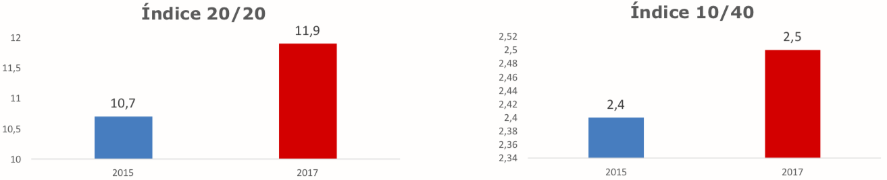
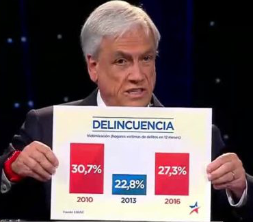
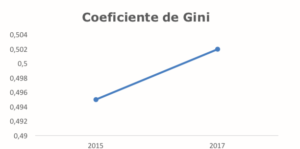

```{r setup, include=FALSE}
library(tufte)
# invalidate cache when the tufte version changes
knitr::opts_chunk$set(tidy = FALSE, cache.extra = packageVersion('tufte'))
options(htmltools.dir.version = FALSE)
```

```{r, echo=FALSE}
library("ggplot2"); theme_set(theme_light())
library("knitr")
library("png")
```

Una de las decisiones más llamativas, y de las que más se habló en los medios,^[Por ejemplo, en [El Dínamo](https://www.eldinamo.cl/nacional/2018/08/22/casen-los-abultados-graficos-sobre-desigualdad-que-se-utilizaron-para-diferencias-no-significativas/) y [El Desconcierto](http://www.eldesconcierto.cl/2018/08/21/graficos-vuelven-a-penar-a-pinera-la-curiosa-forma-de-presentar-los-datos-de-distrubucion-de-ingresos-en-la-casen/).] es la libertad con la que se manipularon los ejes de gráficos que presentan datos sobre la distribución de ingresos. Hay dos problemas principales.

## 1. Diferencias exageradas

El primer problema es que los ejes de varios gráficos de barras están ajustados para sugerir, visualmente, el mismo incremento en todos los indices. El efecto se magnifica al poner gráficos con ejes muy diferentes uno al lado del otro. Un ejemplo de la presentación:

```{r, fig-fullwidth, fig.width = 10, fig.height = 2, out.width = 800, fig.fullwidth = TRUE, warning=FALSE, message=FALSE, cache=TRUE, echo = FALSE}

```

El gráfico de la izquierda indica que hubo un incremento de *1,2* del *2015* al *2017* en el índice. El de la derecha muestra uno de tan solo *0,1*.^[Resalta también la anomalía de un eje que va de *2,34* a *2,52*. Sugiere que diferencias de *0.01* en el *Índice 10/40* son relevantes al comparar valores bianuales.] Los números en los ejes y los que se encuentran sobre las barras dejan claro que se trata de incrementos muy diferentes. Las barras, por otro lado, sugieren un incremento casi idéntico ya que  barras de un mismo color están (casi) a la misma altura de índice a índice. Puesto de otra manera, la diferencia de magnitudes no es nada obvia al comparar la altura de las barras, que es como principalmente consumimos información visual de este tipo.

Es cierto que los datos están en los ejes y sobre las barras. No podemos hablar de una manipulación numérica.^[En comparación con los gráficos de Sebastián Piñera en el debate presidencial del Noviembre pasado. <br> ] La manipulación es visual. Se aprovecha la manera en la que procesamos información cuando nos es presentada de esta manera: Cuando diferencias son grandes, esperamos que estas sean reflejadas, proporcionalmente, por diferencias de altura en las barras. Si se presenta el mismo tipo de información, por ejemplo, indicadores de la distribución del ingreso, se debería usar la misma escala en diferentes gráficos. Más aún si se posiciona uno al lado del otro.  

## 2. Sugerencias de diferencias no encontradas

El segundo problema es un poco más sutil pero mucho más importante. Se trata del mensaje al público: la sugierencia que hubo una mejora importante entre el *2015* y el *2017*. En términos políticos, sugiere que la situación ha mejorado en el año de gestión de Sebastián Piñera en comparación con el gobierno de Michelle Bachelet. 

Los números de los gráficos tomados por si solos no son informativos sobre si hubo o no un cambio relevante. Para alguien que no ha visto el análisis completo no está claro si una diferencia de *0,1* en el *Índice 10/40*, ni la de *1,2* en el otro índice, es un incremento notable; si acaso podría ser un artefacto de como se condujo la encuesta; o si es cae en el rango de la variabilidad esperada año por año. En otras palabras, podría ser que el gobierno no es el principal responsable para cambios de esta magnitud ya que estos índices a veces suben un poco y a veces bajan un poco año a año. 

La tarea principal una visualización de resultados, en particular la de una tan importante como esta, es presentar de manera compacta  lo que se aprendió del análisis que responde este tipo de preguntas. Intuitivamente: grandes diferencias visuales indican que el análisis estadístico, escondido de la audiencia en una presentación de esta naturaleza, sugiere que hay una diferencia importante entre estos dos años. Un buen gráfico refleja el análisis técnico del que nace. Lo condensa, informando de manera simple y directa. Es en este aspecto donde más se criticó la presentación. El caso más obvio es el incremento del Coeficiente de Gini sugerido en el folio 28:

```{r, fig-fullwidth2, fig.width = 10, fig.height = 2, out.width = 500, fig.align="center", fig.fullwidth = TRUE, warning=FALSE, message=FALSE, cache=TRUE, echo = FALSE}

```

No solo se ha elegido un eje ínfimo (*0,49* a *0,504*) para exagerar el alza del Coeficiente entre el *2015* y el *2017*. Lo peor es que en una nota de pie nos informan que la diferencia no es significativa.^[También hay problemas con la [metodología estadística empleada](./casen2017/05nht.html) y críticas que mencionar sobre el uso del [Coeficiente de Gini](./casen2017/06gini.html). Aquí solo me enfoco en lo visual. Véase el índice abajo para detalles sobre los otros dos puntos.] En otras palabras, los mismos analistas nos dicen que la diferencia entre los dos años, sugerida enfáticamente por el gráfico, no es de fiarse. El coeficiente no ha cambiado lo suficiente como para decir que hay una diferencia entre un año y el otro. Sería mucho más verosimil utilizar un eje más amplio y así mostrar una linea (casi) recta en vez de una empinada que favorece al actual gobierno. 

# Resumen

Una buena visualización informa sobre los datos y su análisis. Diferencias representadas tienen que ser diferencias que importan. Su magnitud tiene que reflejar la magnitud del efecto. Usar diferentes ejes al hablar sobre datos de la misma naturaleza es suboptimo. Forzar alturas parecidas entre barras con ejes completamente diferentes es sugestión engañosa. Mostrar alzas donde ni siquiera el análisis que uno mismo condujo lo indican es manipulación. Visualización es política.

## Algunas, de muchas, soluciones prácticas
1. Usar el mismo eje para datos del mismo tipo. Así queda claro que, por ejemplo, la diferencia entre el año *2015* y el año *2017* es menor en el *Indice 10/40* que en el *Indice 20/20*.

```{r, echo = FALSE, fig.width = 6, fig.heigth = 4, out.width = 700, full.width=TRUE,  warning=FALSE, message=FALSE, cache=TRUE}

distribucion <- data.frame("idx" = factor(c("Indice 20/20","Indice 20/20", 'Indice 10/40', 'Indice 10/40'), levels = c("Indice 20/20", "Indice 10/40")),
                           "year" = c("2015","2017","2015","2017"),
                           "value" = c(10.7,11.9,2.4,2.5))
myred <- 'red'
myblue <- 'blue'
myalpha <- 0.8

ggplot(distribucion, aes(x = year, y = value, fill = c('r','b', 'r','b'))) + 
                   geom_bar(stat="identity", position = "dodge", alpha = myalpha) +
                   facet_wrap(~ idx) +
                   scale_fill_manual(values=c(myblue, myred)) + 
                   theme(legend.position="none") + # remove legend (that comes from dummy categories)
                   geom_text(aes(label=value), vjust=2.6, color="white", size=8) +
                  theme(axis.title.x=element_blank(),
                  axis.title.y=element_blank(),
                  axis.text.x = element_text(size=14),
                  axis.text.y = element_text(size=14),
                  strip.text.x = element_text(size = 18, color = "black"))
  
```

2. Apilar los indices y usar un único eje para mantener comparabilidad. Así vemos  si cambios son grandes o pequeños dentro de un solo índice como también como se compara con los otros índices. La desventaja es que si las diferencias son pequeñas en algunos indices pueden llegar a ser dificiles de ver. Este es el caso para el *Indice 10/40*. De nuevo: Depende de lo que quiera transmitirse. Quizás lo relevante es que el cambio es casi impercetible. 

```{r, echo = FALSE, fig.width = 6, fig.heigth = 4, out.width = 700, full.width=TRUE,  warning=FALSE, message=FALSE, cache=TRUE}
library("dplyr")
distribucion["diffvalue"] <- c(10.7,1.2,2.4,0.1)
ggplot(distribucion, aes(x = idx, y = diffvalue, fill = factor(year, levels = c("2017", "2015")))) +
  labs(fill='A\u00F1o') +
  geom_bar(stat = "identity", alpha = myalpha, width = 0.5) +
                     scale_fill_manual(values=c(myblue, myred)) + 
#                   theme(legend.position="none") + # remove legend (that comes #from dummy categories) +
                  theme(axis.title.x=element_blank(),
                  axis.title.y=element_blank(),
                  axis.text.x = element_text(size=20),
                  axis.text.y = element_text(size=14),
                  strip.text.x = element_text(size = 18, color = "black"))
  
```

3. Modificaciones de ejes no tienen por qué ser negativas. Muchas veces pueden utilizarse para comunicar mejor lo aprendido del análisis. Si queremos expresar que no hay una diferencia significativa, por ejemplo, podemos elegir el rango numérico del eje-*y* para que la linea que une los dos años refleje que el cambio es poco o irrelevante. Por ejemplo así:

```{r, echo = FALSE, fig.width = 6, fig.heigth = 4, out.width = 500, full.width=TRUE,  warning=FALSE, message=FALSE, cache=TRUE}

gini <- data.frame("year" = c("2015", "2017"), "value" = c(0.495, 0.502))
ggplot(gini, aes(x = year, y = value, group = 1)) +
        geom_point(size=3.5, color = myblue, alpha = myalpha+0.15) +
        geom_line(size=1.5, color = myblue, alpha = myalpha) +
        ylim(0.325,0.625) + 
        ggtitle("Coeficiente de Gini") +
        theme(axis.title.x=element_blank(),
                  axis.title.y=element_blank(),
                  axis.text.x = element_text(size=20),
                  axis.text.y = element_text(size=14), 
                  plot.title = element_text(size=22, face="bold.italic", hjust = 0.5))
```
---
# Indice temático y links
## [Introducción](../casen2017-intro.html)
## Visualización 
* Ejes que engañan
* [Gráficos circulares](./casen2017/02pie-charts.html)
* [Tablas que agrupan lo in-agrupable](./casen2017/03tablas)

## Análisis y metodología estadística
* [Estimados de puntos y perdida de información](./casen2017/04point-estimates.html)
* [Hipótesis nula (casi) no interpretable](./casen2017/05nht.html)
* [El Coeficiente de Gini](./casen2017/06gini.html)
