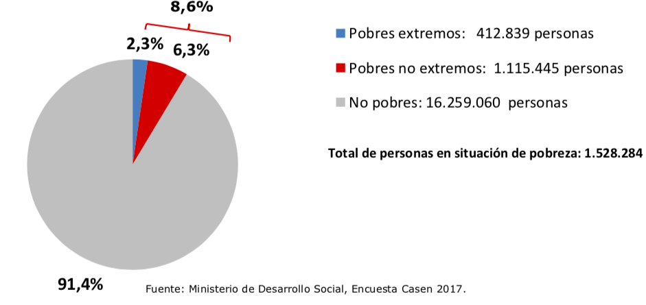

```{r setup, include=FALSE}
library(tufte)
# invalidate cache when the tufte version changes
knitr::opts_chunk$set(tidy = FALSE, cache.extra = packageVersion('tufte'))
options(htmltools.dir.version = FALSE)
```
```{r, echo=FALSE}
library("ggplot2"); theme_set(theme_light())
library("knitr")
library("png")
```
Este problema es menor pero tan fácil de corregir que tendrá que ser repetido hasta que deje de ser cometido. Gráficos circulares no son efectivos medios de comunicación visual.^[**fuentes**] Miremos, por ejemplo, el que se nos presenta en el folio *6*:

```{r, fig-fullwidth, fig.width = 10, fig.height = 2, out.width = 800, fig.fullwidth = TRUE, warning=FALSE, message=FALSE, cache=TRUE, echo = FALSE}

```

Ignorando la cantidad de información presentada en la leyenda, la pregunta es si esta representación circular nos ayuda a entender los datos presentados. En su esencia, un gráfico circular codifica información por (i) areas y (ii) ángulos. Algo que ya se sabe hace mucho -- por lo menos a quien le interesa si su presentación es entendible -- por su intenso estudio es que el ojo humano es pésimo comparando áreas y ángulos ¿Hay solución? Si, nuestros ojos son mucho mejores comparando diferencias de líneas y posiciones. Comparemos la misma información en forma de un gráfico de barras:

```{r, echo = FALSE}
data <- data.frame("percentage" = c(0.914, 0.063, 0.023), type = factor(c("No pobres", "Pobres no extremos", "Pobres extremos"), levels = c("Pobres extremos", "Pobres no extremos","No pobres")))

myred <- 'red'
myblue <- 'blue'
myalpha <- 0.75

ggplot(data, aes(x = type, y = percentage, fill = c('a','b','c'))) +
             geom_bar(stat = "identity", alpha = myalpha) +
             coord_flip() +
                   scale_fill_manual(values=c('grey', myred, myblue)) + 
                   theme(legend.position="none") + # remove legend (that comes from dummy categories)
                   geom_text(aes(label=c('91%', '6.3%', '2.3%'), angle = 270), vjust=c(1.2,-0.8,-0.8), color="black", size=8) +
                  theme(axis.title.x=element_blank(),
                  axis.title.y=element_blank(),
                  axis.text.x = element_text(size=14),
                  axis.text.y = element_text(size=20),
                  strip.text.x = element_text(size = 18, color = "black"))
```

O apilando los dos tipos de pobreza, como lo intenta el gráfico circular de la encuesta: **stacked**


```{r, echo = FALSE, warning = FALSE}
data <- data.frame("percentage" = c(0.914, 0.063, 0.0, 0.023), type = c("No pobres", "Pobres", "No pobres", "Pobres"), lvl = c("Ceros", "No extrema", "Ceros", "Extrema"))
ggplot(data, aes(x = factor(type, levels = c("Pobres", "No pobres")) , y = percentage, fill = factor(lvl, levels = c('Ceros',"Extrema", "No extrema"), labels = c(1, 'Extrema', 'No extrema')))) +
             geom_bar(stat = "identity", alpha = myalpha) +
             coord_flip() +
                       scale_fill_manual(values=c('grey', myred, myblue), breaks = c('Extrema','No extrema')) + 
                     labs(fill='') +
                     geom_text(aes(label=c('91%', '2.3%', NA,'6.3%')), color="black", size=8, angle=270, vjust=c(-0.6, -0.8 ,NA, 0.2), hjust = c(0.25,0.8,0.0,-0.15)) +
                  theme(legend.position=c(0.75,0.2)) + # remove legend (that comes #from dummy categories) +
                  scale_x_discrete(labels = c("NA" = "No pobres", "Pobres" = "Pobres")) +
                  scale_y_continuous(limits = c(0,1), breaks = c(0,0.25,0.5,0.75,1)) + 
                  theme(axis.title.x=element_blank(),
                  axis.title.y=element_blank(),
                  axis.text.x = element_text(size=20),
                  axis.text.y = element_text(size=20),
                  strip.text.x = element_text(size = 18, color = "black"),
                  legend.text=element_text(size=20))
```

---
# Indice temático y links
## [Introducción](../casen2017-intro.html)
## Visualización 
* [Ejes que engañan](./casen2017/01ejes.html)
* Gráficos circulares
* [Tablas que agrupan lo in-agrupable](./casen2017/03tablas)

## Análisis y metodología estadística
* [Estimados de puntos y perdida de información](./casen2017/04point-estimates.html)
* [Hipótesis nula (casi) no interpretable](./casen2017/05nht.html)
* [El coeficiente Gini](./casen2017/06gini.html)
