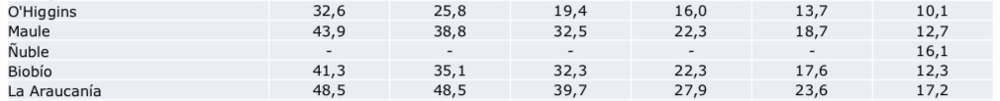

```{r setup, include=FALSE}
library(tufte)
# invalidate cache when the tufte version changes
knitr::opts_chunk$set(tidy = FALSE, cache.extra = packageVersion('tufte'))
options(htmltools.dir.version = FALSE)
```

[Lo que vale para gráficos](./01ejes.html) también vale para tablas. Datos que se presentan juntos tienen que ser comparables. La presentación de la encuesta Casen 2017 no contiene demasiadas tablas. Principalmente son usadas para resumir desarrollos anuales por región, como el porcentaje de personas en situación de pobreza por región, del año *2006* al año *2017*. El problema es que las regiones de Chile han cambiado a lo largo de este periodo.

```{r, echo=FALSE}
library("knitr")
library("png")
```

```{r, fig-fullwidth, fig.width = 10, fig.height = 2, out.width = 650, fig.fullwidth = TRUE, warning=FALSE, message=FALSE, cache=TRUE, echo = FALSE}

```

La presentación pone particular énfasis en detectar, por región, cambios del año *2015* al año *2017*. Como la (ahora nueva) Región de Ñuble en el *2015* era parte de la (antigua) Región del Biobío, no se cuenta con cifras para hacer esta comparación. Esto es normal y es mencionado en un pie de nota bajo las tablas relevantes. Lo que no es normal es que las tablas tengan una única fila llamada *Región del Biobío*. Esta fila se refiere a diferentes territorios con una misma denominación. Una fila debería tener un solo significado^[En este caso, una delimitación territorial que no cambie, en este caso.] para que las las columnas sean interpretables.^[Wickham (2013): *Tidy Data*. Journal of Statistical Software.]

Parece un problema con poca consecuencia pero no lo es. La asumpción básica tiene que ser que se presentan datos de un mismos tipo que son comparables, por lo menos en una dimensión, si aparecen en el mismo gráfico o la misma tabla. Que esto puede conllevar gran confusión fue demostrado a principios de año, cuando se discutía una manipulación de datos del Banco Mundial que perjudicó, en la posición adjutdicada a Chile en uno de sus barómetros, al gobierno de Michelle Bachelet y favoreció a Sebastian Piñera. Mucha tinta se derramó al respecto. Lo relevante aquí es que el cálculo del barómetro cambia de año a año. Que alguien diga que un país subió o bajó en el barómetro es un malentendido. Tal como no podemos comparar la situación de pobreza del *2015* y del *2017* en la Región del Biobío sin tomar en cuenta que este nombre no denomina el mismo territorio en ambos años tampoco podemos comprar la posición de un país en el barómetro del Banco Mundial de un año al siguiente si cambió el cálculo del que deriva. Esto es algo que debería estar claro para todo experto,^[El Banco Mundial lo menciona en [el rubro de metodología](http://www.doingbusiness.org/methodology) de su ranking *Doing Business*.] pero la manera en la cual se discutió la manipulación sugiere que mucho periodísta y político asume que hay una comparabilidad directa.

En resumen, lo de comparar peras y manzanas claramente aplica a datos, gráficos, tablas e análises en general. No es una comparación imposible pero no es algo que pueda hacerse sin más. Visualmente, y desde un punto de vista de organización de datos coherentes, una fila en una tabla corresponde a una observación única. Su significado no cambia en función de las columnas.

---
# Indice temático y links
## [Introducción](../casen2017-intro.html)
## Visualización 
* [Ejes que engañan](./01ejes.html)
* [Gráficos circulares](./02pie-charts.html)
* Tablas que agrupan lo incomparable

## Análisis y metodología estadística
* [Estimados de puntos y perdida de información](./04point-estimates.html)
* [Hipótesis nula (casi) no interpretable](./05nht.html)
* [El coeficiente Gini](./06gini.html)
