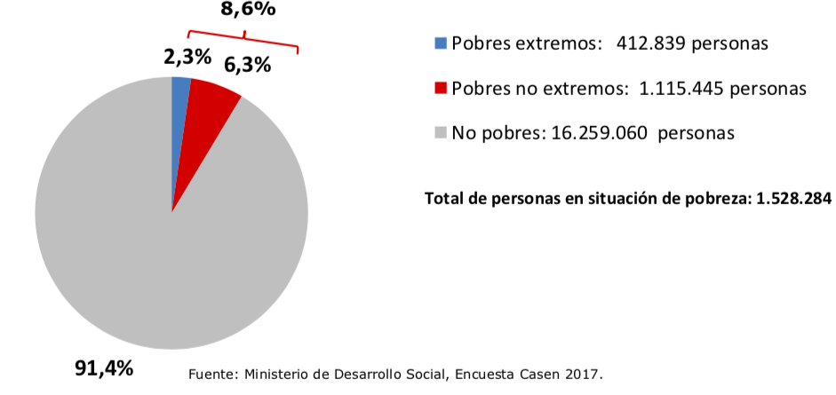

```{r setup, include=FALSE}
library(tufte)
# invalidate cache when the tufte version changes
knitr::opts_chunk$set(tidy = FALSE, cache.extra = packageVersion('tufte'))
options(htmltools.dir.version = FALSE)
```
```{r, echo=FALSE}
library("ggplot2"); theme_set(theme_light())
library("knitr")
library("png")
```
En el contexto de la presentación este problema es muy menor. Por otro lado, es tan fácil de corregir que vale la pena mencionarlo: Gráficos circulares no son (casi nunca) efectivos medios de comunicación visual. Un ejemplo de la presentación:

```{r, fig-fullwidth, fig.width = 10, fig.height = 2, out.width = 700, fig.fullwidth = TRUE, warning=FALSE, message=FALSE, cache=TRUE, echo = FALSE}

```

Ignorando la leyenda, la pregunta es si esta representación nos ayuda a entender los datos presentados. Se presentan dos aspectos a comparar. El primero compara tres categorias: *No pobres* vs. *Pobres extremos* vs. *Pobres no extremos*. Este grupo es el que muestra el circulo y sus áreas delimitadas. Además de las críticas generales que se pueden hacer a gráficos circulares, mencionadas abajo, aquí no hay un gran problema. Está más o menos claro que la categoría de *Pobres extremos* es unas tres veces más pequeña que la de *Pobres no extremos*. Es difícil ver como se relaciona la proporción de esta última categoría con la de *No pobres*, pero mínimamente se ve que hay una diferencia grande. Según la encuesta, hay muchos más *No pobres*.

El segundo aspecto a comparar es de un nivel hierarquico más alto. Compara *No pobres* con *Pobres*. Como no se encontró una manera de meter esta información en el círculo, se añadieron llaves que suman los porcentajes de los dos tipos de pobreza, para un total un *8,6%*. Aquí es donde más falla el gráfico. No es fácil relacionar estas proporciones sin guiarnos por los números. En otras palabras, el gráfico no ayuda. Una tabla hubiera sido igual de informativa; y más ordenada.

En su esencia, un gráfico circular codifica información por areas y ángulos. Juntando esta información, el circulo muestra como se relacionan las proporciones de diferentes categorías que componen el círculo. Algo de lo que se tiene evidencia por lo menos desde los años *80*^[Cleveland & McGill (1984): *Graphical Perception: Theory, Experimentation, and Application to the Development of Graphical Methods*. Journal of the American Statistical Association.] -- siendo también repetido por expertos en visualización^[Por ejemplo, [Edward Tufte](https://www.edwardtufte.com/tufte/books_vdqi) y [Stephen Few](https://www.perceptualedge.com/articles/visual_business_intelligence/save_the_pies_for_dessert.pdf). Para opiniones sobre cuando gráficos circulares si pueden ser una buena opción veáse también artículos de [Ann K. Emery](http://annkemery.com/pie-chart-guidelines/) y [Randy Olson](https://www.oreilly.com/ideas/in-defense-of-the-pie-chart).] hace mucho -- es que los humanos somos malos comparando áreas y ángulos. En otras palabras, graficos circulares son difíciles de comprender por la manera en la que codifican información. 

¿Hay soluciónes? Sí. Somos mucho mejores comparando diferencias representadas por líneas y posiciones. Por eso (casi siempre) es mejor remplazar gráficos circulares por gráficos de barras. Por ejemplo, aquí está la misma información del círculo de arriba en forma de un gráfico de barras:

```{r, echo = FALSE, fig.width = 6.5, fig.heigth = 2, out.width = 500, full.width=TRUE,  fig.align="center", warning=FALSE, message=FALSE, cache=TRUE}
data <- data.frame("percentage" = c(0.914, 0.063, 0.023), type = factor(c("No pobres", "Pobres no extremos", "Pobres extremos"), levels = rev(c("Pobres extremos", "Pobres no extremos","No pobres"))))

myred <- 'red'
myblue <- 'blue'
myalpha <- 0.8

ggplot(data, aes(x = type, y = percentage, fill = c('a','b','c'))) +
             geom_bar(stat = "identity", alpha = myalpha) +
                   scale_fill_manual(values=c('grey', myred, myblue)) + 
                   theme(legend.position="none") + # remove legend (that comes from dummy categories)
                   geom_text(aes(label=c('91%', '6.3%', '2.3%')), vjust = c(1.5,-0.25,-0.25), hjust=0.3, color="black", size=8) +
                  theme(axis.title.x=element_blank(),
                  axis.title.y=element_blank(),
                  axis.text.x = element_text(size=14),
                  axis.text.y = element_text(size=20),
                  strip.text.x = element_text(size = 18, color = "black"))
```

Admito que, en este caso, la mejora en comparabilidad no es demasiado aparente. Además todavía no es fácil comparar visualemente a los integrantes del segundo grupo: *No pobres* vs. *Pobres* (salvo si somos tan poco creativos como el Ministerio y sumamos los números de las dos barras inferiores añadiendo una llave). Nuevamente hay soluciones. Por ejemplo, apilar barras si se trata de categorías que se subsuman. Como es el caso con *Pobres extremos* y los *No extremos*, que juntos componen el grupo de *Pobres*.

```{r, echo = FALSE, fig.width = 6.5, fig.heigth = 2, out.width = 500, full.width=TRUE,  fig.align="center", warning=FALSE, message=FALSE, cache=TRUE}
data <- data.frame("percentage" = c(0.914, 0.063, 0.0, 0.023), type = c("No pobres", "Pobres", "No pobres", "Pobres"), lvl = c("Ceros", "No extrema", "Ceros", "Extrema"))
ggplot(data, aes(x = factor(type, levels = c("Pobres", "No pobres")) , y = percentage, fill = factor(lvl, levels = c('Ceros',"Extrema", "No extrema"), labels = c(1, 'Extremos', 'No extremos')))) +
             geom_bar(stat = "identity", alpha = myalpha) +
                       scale_fill_manual(values=c('grey', myred, myblue), breaks = c('Extremos','No extremos')) + 
                     labs(fill='') +
                     geom_text(aes(label=c('91%', '2.3%', NA,'6.3%')), color="black", size=6, vjust = c(1.5,-0.65,0.0,0.35), hjust = c(0.3,1,0.0,-0.15)) +
                  theme(legend.position=c(0.25,0.85)) + # remove legend (that comes #from dummy categories) +
                  scale_x_discrete(labels = c("NA" = "No pobres", "Pobres" = "Pobres")) +
                  scale_y_continuous(limits = c(0,1), breaks = c(0,0.25,0.5,0.75,1)) + 
                  theme(axis.title.x=element_blank(),
                  axis.title.y=element_blank(),
                  axis.text.x = element_text(size=18),
                  axis.text.y = element_text(size=18),
                  strip.text.x = element_text(size = 18, color = "black"),
                  legend.text=element_text(size=15))
```

Repito que, en este caso, el problema no es grave.^[Hay detalles metodológicos mucho más importantes. Por ejemplo, la manera en la que se calculó el *8,6%* de pobreza total mencionado en el gráfico, como discute [un reciente artículo de la Fundación SOL](http://www.fundacionsol.cl/2018/09/las-trampas-del-famoso-alquiler-imputado/).] Pero es algo que siempre hay que tomar en cuenta. Si se está por hacer un gráfico circular, se debería considerar si la información no sería mejor representada por otro tipo de gráfico que sea más fácil de procesar. Si hay que añadir una leyenda, porcentajes, y números totales se debería considerar el uso de una tabla. 

---
# Indice temático y links
## [Introducción](../main.html)
## Visualización 
* [Ejes que engañan](./01ejes.html)
* Gráficos circulares
* [Tablas que agrupan lo incomparable](./03tablas.html)

## Análisis y metodología estadística
* [Estimados de puntos y perdida de información](./04point-estimates.html)
* [Hipótesis nula (casi) no interpretable](./05nht.html)
* [El coeficiente Gini](./06gini.html)
