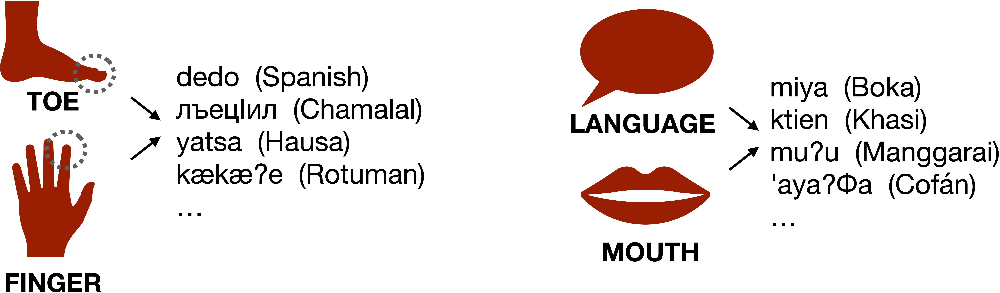
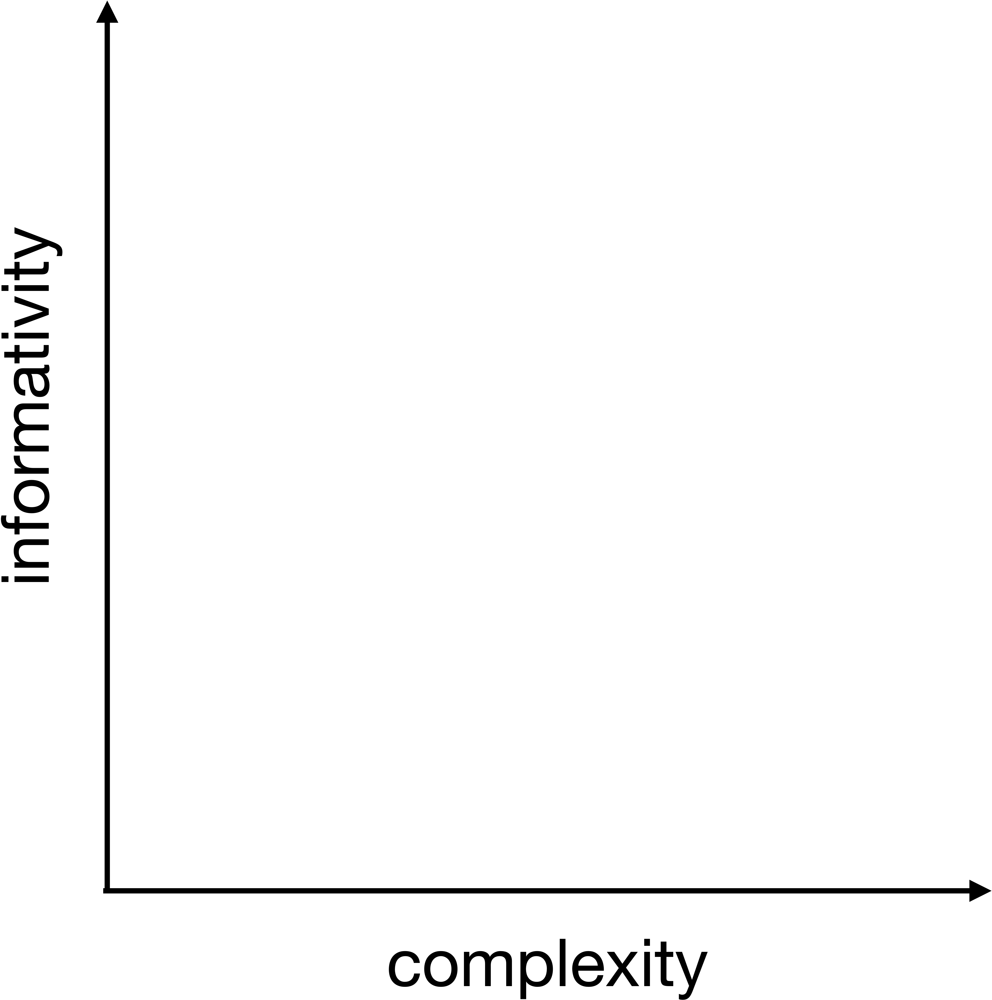
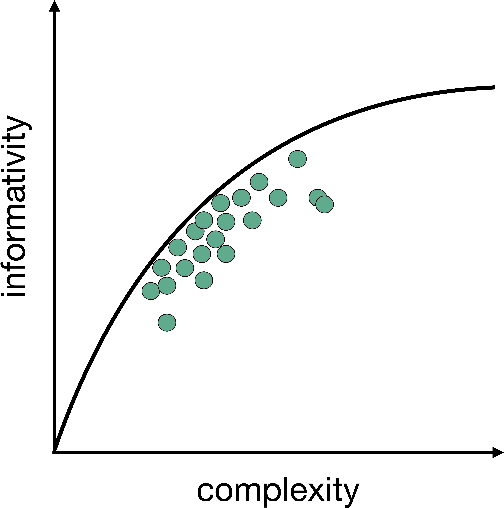
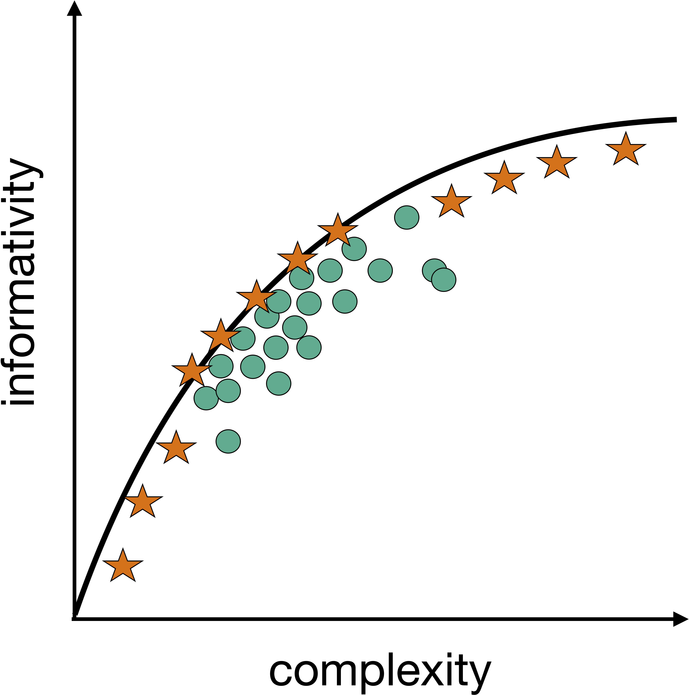
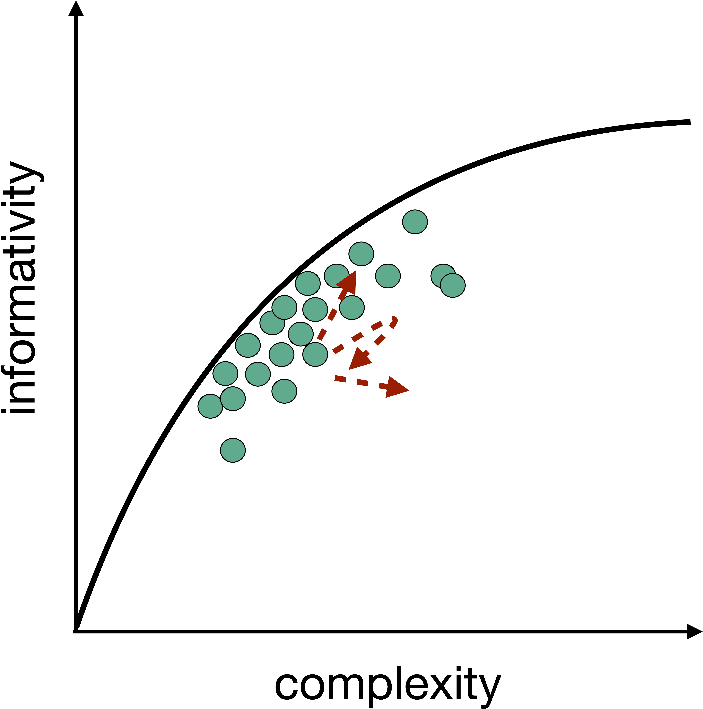

### Semantics differ across languages  but there is also regularity

::: {layout="[[-1], [1], [-1]]"}

:::

::: {.notes} 
Lexica differ in the way they carve out reality
Yet reality is carved out in semblant ways 
:::

---

### Semantic regularity as constraint satisfaction 

{fig-align=center width=50%}

::: footer
Zaslavsky et al. 2018, [Brochhagen & Boleda 2022]{style='color:indianred;'}, ...
:::

---

### Semantic regularity as constraint satisfaction

{fig-align=center width=50%}

---

### Semantic regularity as constraint satisfaction {visibility="uncounted"}

{fig-align=center width=50%}

---

### Unexplained gaps

{fig-align=center width=50%}

---

### Unexplained trajectories 

{fig-align=center width=50%}

---

### Unexplored landscapes
{fig-align=center width=65%}

---

### Unexplored landscapes
{fig-align=center width=65%}

---

### [MUTANDIS]{style='color:indianred;'}
#### semantics from the ground up
  

* Develop a dynamic account of the organization of meaning: from individuals to languages

* Study effects of differential communicative needs and contextual information

---

### Meaning conflation as key signature of lexical organization

::: {layout="[[-1], [1], [-1]]"}

:::

---

### Meaning conflation as key signature of lexical organization

* Full conflation

* Partial conflation

* No conflation

---

### Need and context
#### understudied cross-linguistic variables

  

{fig-align=center width=95%}

---

### Need and context
#### understudied cross-linguistic variables

 
{fig-align=center width=95%}

---

### Need and context
#### understudied cross-linguistic variables

 
{fig-align=center width=95%}

---

### Need and context
#### understudied cross-linguistic variables

 
{fig-align=center width=95%}

---

{.absolute top=100 left=0 width="1550" height="320"}

---

{.absolute top=100 left=0 width="1550" height="320"}

---

{.absolute top=100 left=0 width="1550" height="320"}

---
::: {.center-xy}
### Dynamics in the evolution of meaning: &nbsp;&nbsp;&nbsp;&nbsp;&nbsp;&nbsp;&nbsp;&nbsp;&nbsp;&nbsp;from individuals to languages 
### &nbsp;&nbsp;&nbsp;&nbsp;&nbsp;&nbsp;&nbsp;&nbsp;&nbsp;&nbsp;&nbsp;&nbsp;&ensp; &emsp;&ensp; &emsp;&ensp;[MUTANDIS]{style='color:#b22222;'}
 
 &nbsp;&nbsp;&nbsp;&nbsp;&nbsp;&nbsp;&nbsp;&nbsp;&nbsp;&nbsp;&nbsp;&nbsp;&ensp; &emsp;&ensp; &emsp;&ensp; [Thomas Brochhagen]{style='color:#4a5057;'}
:::

## Additional Slide 01 {visibility="uncounted"}

Some additional stuff

## Additional Slide 02 {visibility="uncounted"}

Some more additional stuff
