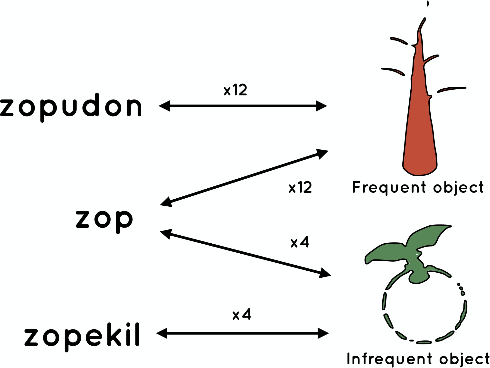
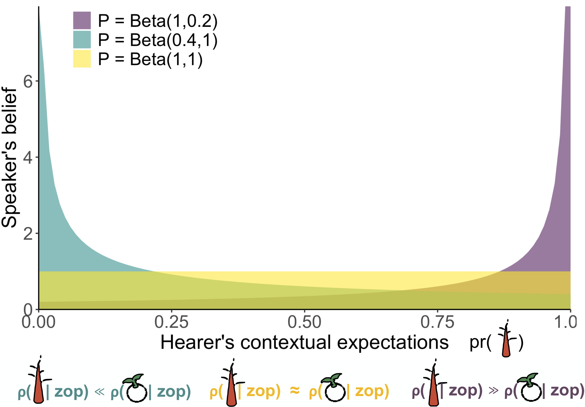
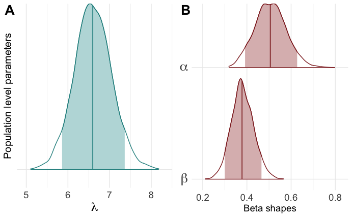
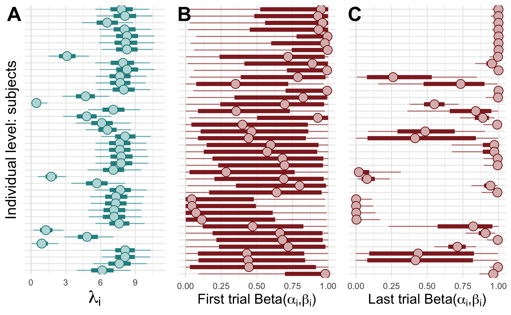

```{r preamble, echo=FALSE, message=FALSE, warning=FALSE}
library(dplyr)
library(ggplot2)
library(readr)

```


# Background

.large[
* Zipf's Law of Abbreviation: frequent forms are shorter

* Inverse relationship between *use* and *linguistic reduction*

* Kanwal et al. (2017): study what drives this relationship <br>by controlling for communicative pressures
]
---

# Background 

.large[
Zipf's Law of Abbreviation: frequent forms are shorter <br>**at the level of languages**
]

.footnote[
***
Zipf (1935): [The Psycho-Biology of Language]()<br><br>
Sigurd et al. (2004): [Word length, sentence length and frequency – Zipf revisited]()<br><br>
Piantadosi et al. (2011): [Word lengths are optimized for efficient communication]()<br><br>
Ferrer-i-Cancho et al. (2013): [Compression as a Universal Principle of Animal Behavior]()<br><br>
...
]


---

# Background 

.large[
Inverse relationship between *use* and *linguistic reduction*
<br> **across strata**
]

.footnote[
***
Clark & Wilkes-Gibbs (1986): [Referring as a collaborative process]()<br><br>
Kim et al. (2011): [Phonetic convergence inspontaneous conversations as a function of interlocutor language distance]()<br><br>
Pickering & Ferreira (2008):  [Structural priming:  A critical review]()<br><br>
Hawkins et al (2017): [Convention-formation in iterated reference games]()<br><br>
...
]

---

# Background 

.large[
Kanwal et al. (2017) study what drives the relationship between<br> frequency and form by controlling for communicative pressures<br> **at the level of dyads**
]

.footnote[
***
Kanwal et al. (2017): [Zipf’s Law of Abbreviation and the Principle of Least Effort: Language users optimise a miniature lexicon for efficient communication](). *Cognition*
]

---

# The study I'll build on today 
Modest re-analysis of Kanwal et al. (2017) to
  * be explicit about speakers' choice functions
  
  * gain insight into how population-level, dyadic-level and individual-level relate to each other; and how to possibly link them
<br><br>
<br><br>
<br><br><br><br>


.footnote[
***
Brochhagen (2021): [Brief at the risk of being misunderstood: Consolidating population- and individual-level tendencies](http://brochhagen.github.io/brochhagen.github.io/content/ms/accepted-manuscript-cobb.pdf). *Computational Brain & Behavior*
]

---

class: inverse, center

# Experimental setup
Kanwal et al. (2017) condition 4

---

## Training (miniature lexicon acquisition)
```{r, out.width="80%", fig.align="center", echo=FALSE, }

```


---
# Testing (condition 4) 

* Pair subjects and let them interact for 62 trials<br><br>32 sender trials, 32 receiver trials (alternating)<br><br>

* Same object frequencies as in training<br><br>

* Message transmission time is proportional to message length<br> $\rightarrow$ Sending ambiguous *zop* takes $\frac{3}{7}$ of the time of alternatives <br><br>

* The fastest & most accurate pairs win a prize<br> $\rightarrow$ Pressure to use short form if you believe your interlocutor will get it

---

# Kanwal et al's analysis

* Logistic regression with short name as binary response<br><br>

* Object frequency (factor), trial number, and their interaction as fixed effects<br><br>

* By-participant intercepts and slopes as random effects for object frequency and trial number<br><br><br><br>

**Finding:** Positive interaction between trial number and the short name for the frequent object<br><br>

---

# Some model desiderata

* Accomodate for multiple association patterns (if they are to be explained)

* Linguistic behavior that can change as a function of interlocutor's behavior

.footnote[
***
Parikh (2000): [Communication, Meaning, and Interpretation]()<br><br>
Brochhagen (2017): [ Signalling under Uncertainty: Interpretative Alignment without a Common Prior ]()<br><br>
Hawkins et al (2017): [Convention-formation in iterated reference games]()
]


---

class: inverse, center

# Speaker model

---
## Intuitions

* RSA-style choice functions (*soft-max*; *Luce's rule*; *rationality parameter*)
<br><br>"If I believe you expect one object over the other (by a large enough margin) I will use the ambiguous form to convey that object. Otherwise, I'll play it safe."<br><br>


* Players change beliefs over time, based on past success/failure using an ambiguous form<br><br>"You interpreted my use of an ambiguous form in a certain way before, thus, I believe you expected this object (and therefore I will be more likely to signal this object with this expression later)"

---
## Relevant parameters to estimate from the data

.left-column[
<br>
$\lambda$

$pr \sim P$ 
]

.right-column[
usual soft-maximization parameter, $\lambda \geq 0$

not-so-usual non-common prior
]

---

## The full speaker model
<br><br>
\begin{align}
\rho(r \mid m;pr) &\propto L(r,m) \; pr(r),\\
\sigma(m \mid s;P) &\propto \text{exp}(\lambda((\int P(\theta)\rho(s \mid m; \theta)d\theta)-c(m))) 
\end{align}
<br>
and
\begin{align}
P_{t+1}(pr \mid w(r);m) \propto (\sum_{r' \in w(r)}\rho(r' \mid m;pr)P_t(pr)),
\end{align}
with $w(r) = \{r\}$ if the interaction was successful and $R \setminus \{r\}$ otherwise.

.footnote[
***
We return to identifiability of Brochhagen (2017) vs. Hawkins et al. (2017) later!
]

---


## Latent beliefs over expectations

```{r, out.width="100%", fig.align="center", echo=FALSE, }

```

---

class: inverse, center

# Models

---

```{r table2, echo=FALSE, message=FALSE, warnings=FALSE, results='asis'}
tabl <- "  # Overview
| Model        | Population parameters          | Individual parameters  |
|---------------|:-------------:|:------:|
| NoPool      | -- | $\\lambda_i, \\alpha_i, \\beta_i$ |
| FullPool $\\lambda,\\alpha, \\beta$      | $\\alpha,\\lambda, \\beta$ |   -- |
| FullPool $\\lambda$ | $\\lambda$      |  $\\alpha_i, \\beta_i$ |
| HM $\\lambda$      | $\\mu_\\lambda$ | $\\lambda_i \\sim N(\\mu_\\lambda,2)$ <br> $\\alpha_i, \\beta_i$ |
| HM $\\lambda, \\alpha, \\beta$      | $\\mu_\\lambda, \\mu_\\alpha, \\mu_\\beta$ | $\\lambda_i \\sim N(\\mu_\\lambda,2),$ <br> $\\alpha_i \\sim N(\\mu_\\alpha,2)$ <br> $\\beta_i \\sim N(\\mu_\\beta,2)$ |


"
cat(tabl) # output the table in a format good for HTML/PDF/docx conversion
```

---

class: inverse, center

# Results


.footnote[
***
Disclaimer: All models were diagnosed to rule out pathologies and cross-validated. 
]

---


```{r table3, echo=FALSE, message=FALSE, warnings=FALSE, results='asis'}
tabl <- "  ## Model comparison
|         | ELPD diff (SE)          | ELPD (SE)  |  EFF (SE) |
|---------------|:-------------:|:------:|:-----:|
| HM $\\lambda, \\alpha, \\beta$      |  0.00 (0.00) | -471.63 (18.74) |  33.75 (3.77) |
| HM $\\lambda$      |  -38.16 (5.74) | -509.79 (18.24) | 25.83 (2.99) |
| FullPool $\\lambda,\\alpha, \\beta$      |  -148.24 (12.17) | -619.88 (22.23) | 3.16 (0.25)|
| FullPool $\\lambda$ |  -154.21 (11.61) | -625.84 (21.24) | 7.83 (0.54) |
| NoPool      | -201.02 (34.55) | -672.65 (51.02) | 84.89 (8.58) |

"
cat(tabl) # output the table in a format good for HTML/PDF/docx conversion
```

<br><br>

The full multi-level model is best across data subsets, obtained by incrementally leaving out worst faring subjects 

---

## Population-level estimates

```{r, out.width="110%", fig.align="center", echo=FALSE, }

```

---
## Individual-level estimates

```{r, out.width="110%", fig.align="center", echo=FALSE, }

```

---
## Other relationships

Insert correlation results here

---


class: inverse, center

# Taking stock


---

## Narrower conclusions

Insert narrower conclusions here that concern Zipf's Law, the data, semantics-pragmatics...

---

class: inverse, center

# Take-aways


---

1. Where possible and called for
  * model variation at multiple levels
  
  * make relationship between levels explicit 

2. Population-level trends can often hide individual-level variation, but the former ultimately draw from the latter.

--

3. Many individual-level patterns go against theoretical predictions (Zipf's Law of Abbreviation, Horn's division of pragmatic labor, Parikh's disambiguation model, ...). The reasons for this are manifold.

--

4. How dyadic-conventions find their way into the population is still a major and fascinating open question

--

5. Whether the association of the ambiguous form with the (in)frequent meaning is semantic or pragmatic in nature is (less fascinating?) open question

---

class: inverse, center


# The end

