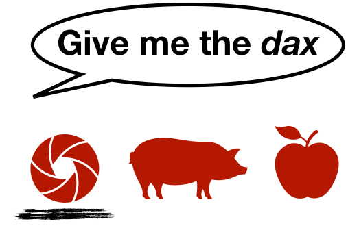
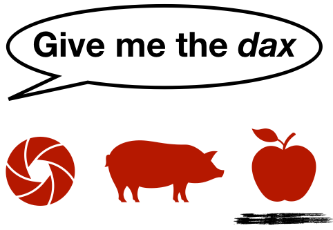
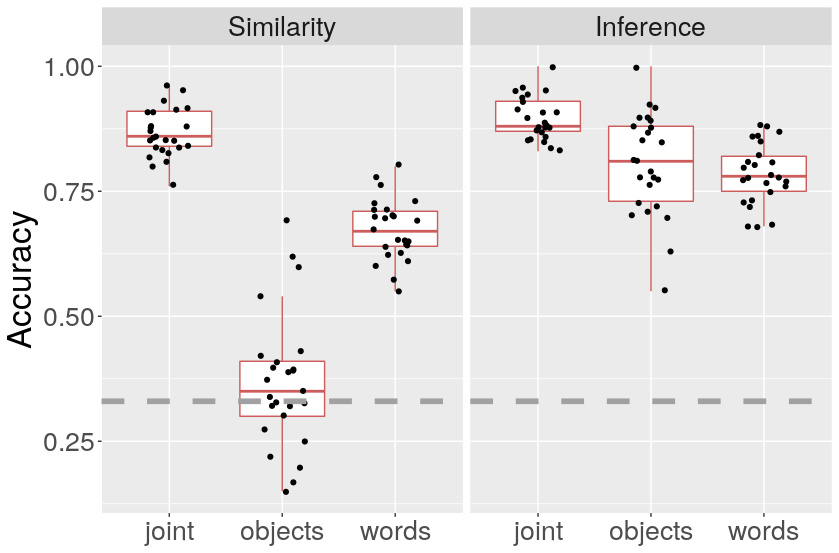
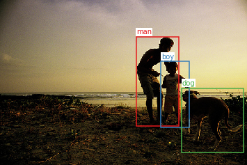
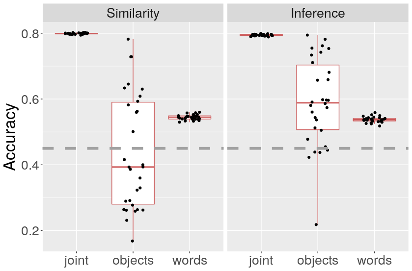

```{r preamble, echo=FALSE, message=FALSE, warning=FALSE}
library(dplyr)
library(ggplot2)
library(readr)

```
class: center
<br>
### Children tend to associate novel words with novel objects
(some caveats apply)
<br><br><br><br>
```{r, out.width="50%", fig.align="center", echo=FALSE, }

```

---
class: center
<br>
### Neural network models do not
(some caveats apply)
<br><br><br><br>
```{r, out.width="50%", fig.align="center", echo=FALSE, }

```

---

# Today's talk

* At least two roads to mutual exclusivity for neural networks

* Shortcomings

* Ways forward

---
<br><br><br><br>
.pull-left[

]

.pull-right[

]

***
.footnote[
* Gulordava et al. (2020): Deep daxes: [Mutual exclusivity arises through both learning biases and pragmatic strategies in neural networks](https://cognitivesciencesociety.org/cogsci20/papers/0479/0479.pdf). Proceedings of CogSci<br><br>
* Work in progress
]

---
### What studies mean by *mutual exclusivity* varies
<br>
1. ME as a pragmatic referent selection strategy<br><br>If other objects have known labels then the speaker should have used these labels if they were intended<br><br> $\rightsquigarrow$ unfamiliar object is intended<br><br>

--
 <br>

2. ME as a vocabulary acquisition bias<br><br>
Already established word-meaning associations inhibit the linkage of new words to these meanings<br><br> $\rightarrow$ new word means unfamiliar object

---
### What we mean by *mutual exclusivity*
<br>
Umbrella term that refers to an observed tendency,<br> remaining agnostic about causes 
---
### Motivations of our first study
  1. Disentangle potential causes for ME and understand possible interactions<br><br>
  *Issue:* Referent selection presupposes learning. Inversely,  latent learning biases cannot simply be read off from how referents are selected<br><br><br>
--

  2. NNs allow us to address (1) in a transparent and scalable way;<br>and they had recently been claimed not to exhibit ME-like tendencies<br><br><br>
--
  
  3. What can we learn about natural language from NNs?
  
---
### Overview study 1

* Train and evaluate NNs on both symbolic and visual data<br><br>

* Study joint effect of learning biases and referent selection strategies<br><br><br>

```{r, out.width="100%", fig.align="center", echo=FALSE, }
magick::image_read_pdf("./overview-me.pdf",
                       pages = 1)
```

---

class: inverse, center

# Models

---
### First Component: Word learning

```{r, out.width="90%", fig.align="center", echo=FALSE, }
magick::image_read_pdf("./maxmargin_schema3.pdf",
                       pages = 1)
```

---

### 1. Max-margin over objects (anti-ambiguity)

\begin{equation*}
  L_o = \sum_i \max(0, 1 - cos(\mathbf{w}, \mathbf{o})  + cos(\mathbf{w}, \mathbf{o_i}))
\end{equation*}
```{r, out.width="75%", fig.align="center", echo=FALSE, }
magick::image_read_pdf("./maxmargin_schema3.pdf",
                       pages = 1)
```


---

### 2. Max-margin over words (anti-synonymy)

\begin{equation*}
      L_w = \sum_i \max(0, 1 - cos(\mathbf{w}, \mathbf{o})  + cos(\mathbf{w_i}, \mathbf{o}))
\end{equation*}

<br><br>

--

<br<br><br>
### 3. Joint loss (one-to-one)

\begin{equation*}
  L = L_w + L_o.
\end{equation*}

---
## Second component: Referent selection
<br>
### 1. Similarity maximizer
Pick object most similar to word<br><br>

--

### 2. Pragmatic reasoner
Pick object most similar to word, factoring in what other words could have been uttered for each object
---
## Second component: Referent selection


```{r, out.width="90%", fig.align="center", echo=FALSE, }
magick::image_read_pdf("./bayesian_selection2.pdf",
                       pages = 1)
```

---

class: inverse, center

# Experiments

---

### Symbolic data set: CHILDES transcriptions from Frank et al. (2009)
  $W$ = {get, the, piggie} <br> $S$ = \{PIG, COW\}<br><br>
  
---
### Symbolic results (novel word task)
```{r, out.width="100%", fig.align="center", echo=FALSE, }

```

---
### Visual data set: Flickr30K Entitites
```{r, out.width="100%", fig.align="center", echo=FALSE, }

```

---
### Visual data set (novel word task)
```{r, out.width="100%", fig.align="center", echo=FALSE, }

```

---
class: inverse

### Conclusions study 1

* ME can be achieved with scalable models with continuous representations and conventional learning algorithms

* Competition over words needs to be induced but it doesn't matter whether in training or referent selection

* This mirrors the observation that true synonyms are rare in natural language (if they exist at all)

****

* Discrimination of words/objects is one prerequisite

* [The representation of novel words is another]()

---
### Motivations for our second study

  * Do away with negative sampling of novel items<br><br> What is an appropriate representation of novelty?<br><br>
  
  * More thorough experimentation
  
    * Not only dogs as novel objects
    
    * Varied and realistic novel words
    
    * More controlled symbolic setup

---
### Proposal: Go sub word-level

--

What we expect:

* No need to specify set of words in advance 

* Novelty as a by-product of unexpected sequences of characters

* Differences in behavior when prompted with (i) known words, (ii) novel pseudo-words, and (iii) novel implausible words

* Worse performance than word-level models

---
### Proposal: Go sub word-level

What we got so far:

* No need to specify set of words in advance $\checkmark$

* Novelty as a by-product of unexpected sequences of characters $\checkmark$

* Differences in behavior when prompted with (i) known words, (ii) novel pseudo-words, and (iii) novel implausible words $\checkmark$(?)

* Worse performance than word-level models $\checkmark$

---
class: inverse

### General conclusions

* ME can be achieved with scalable models with continuous representations and conventional learning algorithms

* Competition over words needs to be induced but it doesn't matter whether in training or referent selection

* This mirrors the observation that true synonyms are rare in natural language (if they exist at all)

* Discrimination of words/objects is one prerequisite

***

* More appropriate representations of novelty can be acquired if we go sub word-level

* Going back and forth between different kinds of agents can be very useful to clarify concepts and put them to the test

---


class: inverse, center


# Thanks!

