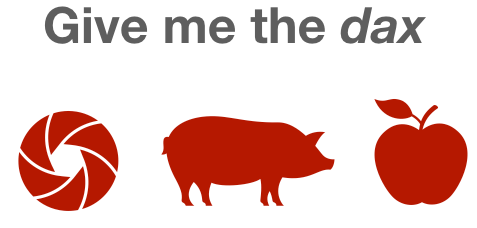

```{r preamble, echo=FALSE, message=FALSE, warning=FALSE}
library(dplyr)
library(ggplot2)
library(readr)

```


## Children exhibit a tendency to associative novel words with novel referents (ME)

<br>
```{r, out.width="70%", fig.align="center", echo=FALSE, }

```

<br><br><br>
.footnote[
***
* Lewis,  M.,  Cristiano,  V.,  Lake,  B. M.,  Kwan,  T., & Frank, M.  C.(2019). The role of developmental changeand linguistic experience in the mutual exclusivity effect.
* Halberda,  J.   (2003).   The development of a word-learningstrategy.Cognition, 87
* Markman, E. M., & Wachtel, G. F.  (1988).  Children’s use of mutual exclusivity to constrain the meanings of words. Cognitive Psychology
* ...
]

---

## (Some) neural network models do not
<br>
```{r, out.width="70%", fig.align="center", echo=FALSE, }

```

.footnote[
***
* Gandhi,  K.,  &  Lake,  B.  M.(2019). Mutual  exclusivity  as  a  challenge  for  neural  networks.
]
---

# Today's talk
* What we mean when we say mutual exclusivity

* At least two roads to ME for neural networks

* Shortcomings and ways forward

---

# team picture!


---

class: inverse, center


# Time for outstanding questions or comments?

